
<div class="text-center">
    <h3>今天搭建了自己的博客 😝</h3>
</div>

花费了 **一天半** 的时间，终于把我的 **个人博客** 搭建完成，下面我写下搭建博客的过程，其实挺简单的 🙃

---

<!-- more -->

### 博客所用技术 （Hexo + Next + GitHubPages）

在文章的末尾我会 **贴出** 我基于 **Hexo + Next + GitHubPages** 搭建博客，所参考的文章链接。

如果，你也想用这些技术搭建漂亮的博客，你就需要了解下 `Hexo` 、 `Next` 、 `GitHubPages` 这三个单词，下面会逐个解释。

####  什么是 Hexo
> **Hexo** 是一个快速、简洁且高效的博客框架。**Hexo** 使用 *Markdown*（或其他渲染引擎）解析文章，在几秒内，即可利用靓丽的主题生成静态网页。 -- [Hexo](https://hexo.io/zh-cn/docs/index.html)

####  什么是 Next

> **NexT** 是 **Hexo**的一个主题（theme），拥有丰富而简单的配置，结合第三方服务，可以打造属于您自己的博客。 -- [Next](http://theme-next.iissnan.com)

#### 什么是 GitHubPages

> GitHub Pages is a static site hosting service designed to host your personal, organization, or project pages directly from a GitHub repository. -- [GitHubPages](https://help.github.com/articles/what-is-github-pages/)

**翻译过来大概是：** GitHub页面是一个静态的站点托管服务，旨在从GitHub存储库中直接托管您的个人、组织或项目页面。

所以，`Hexo` 、 `Next` 、 `GitHubPages` 配合起来就可以免费搭建漂亮的 **个人博客** , 是不是很爽 😆

----
### 如何基于 Hexo 搭建博客

基于 Hexo 搭建博客，只需简单的几步，就能完成 **个人博客** 的搭建。

#### 准备工作

##### 下载安装 `nodejs`

`node` 会自带 `npm` 包管理工具，*建议安装* `yarn` 来管理依赖 （因为 `hexo` 貌似是用 `yarn` 管理 **依赖** 的，否则可以回出现 **依赖** 问题）。

**Mac** 用户可以用 `brew` 安装，**Windows** 可以用 `cmder` 或去官网下安装包程序。

```vim
    brew install node
```

然后用 `npm` 安装 `yarn`

```vim
    npm install yarn
```

##### 安装 `git`

**Mac** 用户可用刚安装的 `yarn` 包管理工具安装 `git`，**Windows** 可以 `cmder` 或去官网下安装包程序。

```vim
    yarn add git -g
```

##### 安装 `hexo`

进入你的项目目录，比如我的是 `myblog` ，

```vim
    cd myblog
```

然后用 `yarn` 安装 `hexo`。

```vim
    yarn add hexo -S
```

此时，环境都准备好了，就可以开始搭建 **hexo** 博客了 😜

----
#### 搭建本地博客

##### 进入你的项目目录

比如：我的是 `myblog`。

```vim
    cd myblog
```

##### 项目初始化

项目初始化，会自动生成博客模板，以后写博客只需用 `markdown` 语法编写对应的 `.md` 文件即可 ✍️ 。

```vim
    hexo init
```
##### 安装所有的依赖 

建议使用用 `yarn` ，否则会出现依赖问题（*在本文之后有相关介绍*）。

```vim
    yarn install
```
##### 最后，启动本地服务

在浏览器输入 `localhost:4000` 即可预览博客

```vim
    hexo server
```

**如图:** 🌁 </br>
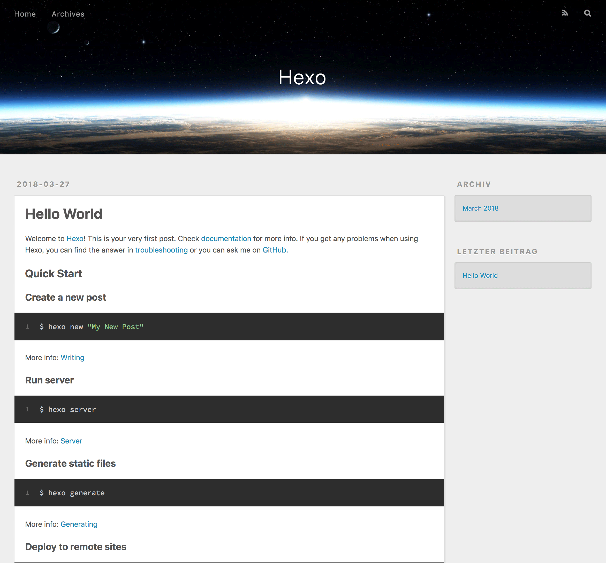

----
### 关联 GitHub

通过 **GitHub** 的 `pages` 功能，我们可以把我们的博客托管到 **GitHub** ，而无需去购买云服务器 😋 ,轻松愉快的构建免费博客。

#### 创建 GitHub 账户

我相信 🤔 大家应该都有 **GitHub** 账号了，如果没有可去 [GitHub](https://github.com/) 官网按照步骤创建账户即可。

#### 配置关联 GitHub

- 有了 **GitHub** 账号之后，登录 **GitHub** ，创建一个项目，项目名称最好和你本地的项目一致，比如： `myblog`


项目建好之后，一定要开启 **GitHub Pages** 功能 ⚠️


- 点击如图 `Settings` 开启，**GitHub Pages** 功能

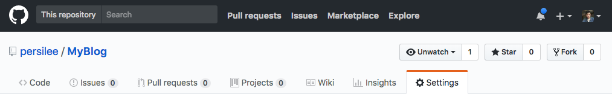

- 选择 `master branch` , 然后 **Save** 

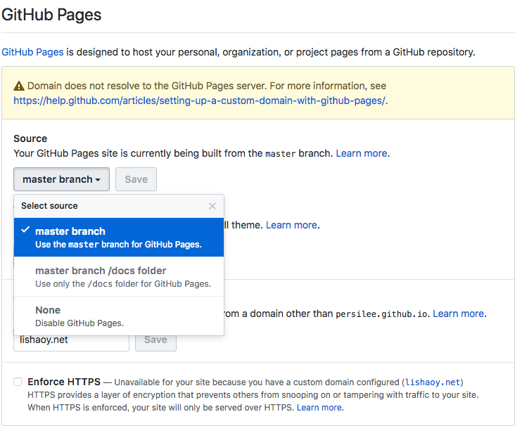

- 复制你的项目连接，如图

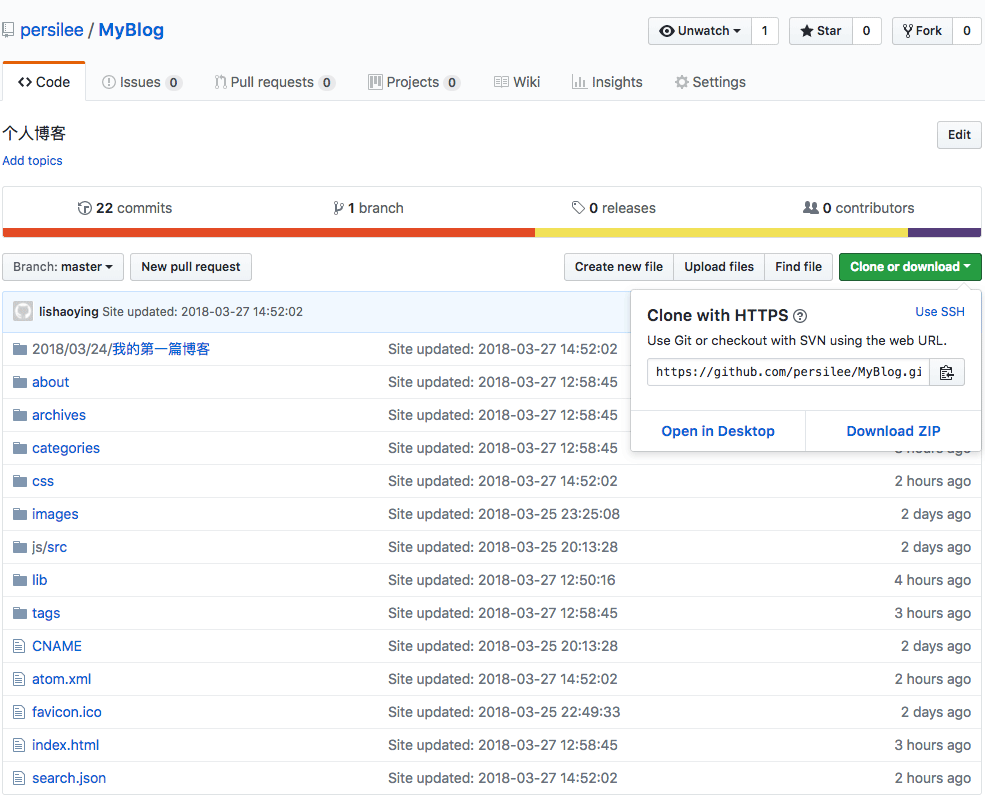

- 然后在你本地项目根目录找到 `_config.yml` 文件，粘贴到以下位置

```yml
# Deployment
## Docs: https://hexo.io/docs/deployment.html
deploy:
  type: git
  repository: https://github.com/persilee/MyBlog.git
  branch: master
```

#### 完成关联

完成以上步骤之后，就可以把自己本地项目推送到 **GitHub** 托管，只剩下3步 😋

1. 安装 `hexo-deployer-git` 插件（可以通过简单的命令,完成文件生成及推送功能）

```vim
    yarn add hexo-deployer-git -S
```

2. 运行 `hexo g` （生成本地文件）

```vim
    hexo g
```

3. 运行 `hexo d` （将本地文件推送到 **GitHub** ，和 `git push` 功能相同）

```vim
    hexo d
```
此时，**GitHub** 应该已给你生成了访问连接，连接格式是: `你的账号名称` + `.github.io` + `\项目名称`,也可以去刚才 `GitHubPages` 设置页面查看
例如我的：[https:\\persilee.github.io\MyBlog](https:\\persilee.github.io\MyBlog)

这时，你就可以把连接发给小伙伴们，他们通过连接都可以访问你的 **博客** 🙃。


**这里需要注意的地方是：在执行 `hexo g` 命令时候，可能会出现以下 `error`,应该是 `yarn` 和 `npm` 冲突的依赖的问题，所以前面文章建议使用 `yarn` 管理包依赖**


```vim
ERROR Plugin load failed: hexo-renderer-marked
Error: EISDIR: illegal operation on a directory, read
ERROR Plugin load failed: hexo-server
Error: EISDIR: illegal operation on a directory, read
ERROR Plugin load failed: hexo-renderer-stylus
Error: EISDIR: illegal operation on a directory, read
```

解决办法，先用 `yarn` 分别移除，再重新安装，如下

```vim
## 先移除
yarn remove hexo-renderer-marked

yarn remove hexo-renderer-stylus

yarn remove hexo-server

## 再安装
yarn add hexo-renderer-marked -S 

yarn add hexo-renderer-stylus -S

yarn add hexo-server -S
```

在执行 `hexo g` ,顺利执行 👌

----

### 绑定域名

我们已经可以通过 **GitHub** 分发给我的地址访问 **博客** ，但是，这对于我们这些爱 **折腾** 的 **程序猿👨‍💻‍** 来说，还不够，弄个自己的 **域名** 才够拉风😂。

于是。。。

开始绑定自己的 **域名** [lishaoy.net](https://lishaoy.net)

然而，我们绑定 **域名** 之后，只支持 `http` 协议，这样我们在 **Google** 浏览器访问时，会有不安全标准，而且，很容易被插入广告，于是。。。**折腾** 走起🌝：搞个 `https`

转入正题，经过一番 **折腾** ，采用第三方服务 [Netlify](https://app.netlify.com/sites/lishaoy/settings/domain#ssl-tls-certificate) 来提供免费的SSL/TLS证书。

当然，这里我提供2种方式绑定域名，一种是 `HTTP` (不安全的网络协议)、一种是 `HTTPS` （安全的网络协议，在 **Google** 浏览器上回有一把小锁，如图）


#### `HTTP` 绑定域名

##### 设置域名解析规则

首先，我们需要去运行商，新增域名解析规则，如图

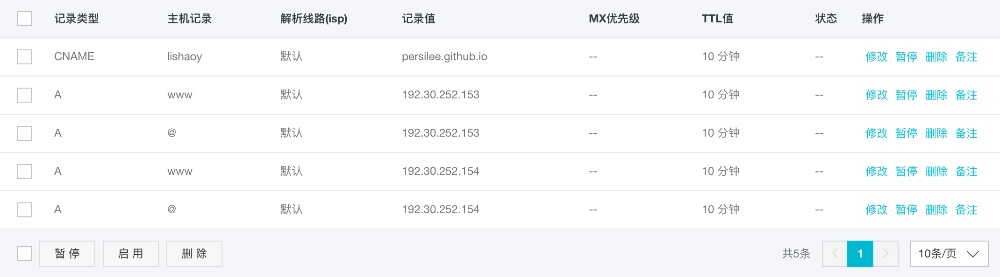

##### 新增 `CNAME` 文件

配置好域名解析规则之后，还需要在项目的 `.\source\` 路径下新增 `CNAME` 文件，输入内容 `你的域名` ,如：[lishaoy.net](https://lishaoy.net)
##### 重新新生成文件，推送到GitHub

重新生成文件，运行 `hexo g`

```vim
    hexo g
```
推送 **GitHub**

```vim
    hexo d
```

-----

#### `HTTPS` 绑定域名
##### 注册 `Netlify` 账号

首先，我们需要注册一个 [Netlify](https://app.netlify.com/sites/lishaoy/settings/domain#ssl-tls-certificate) 账号，地址：[Netlify](https://app.netlify.com/sites/lishaoy/settings/domain#ssl-tls-certificate) ，可以选择用 **GitHub** 注册。

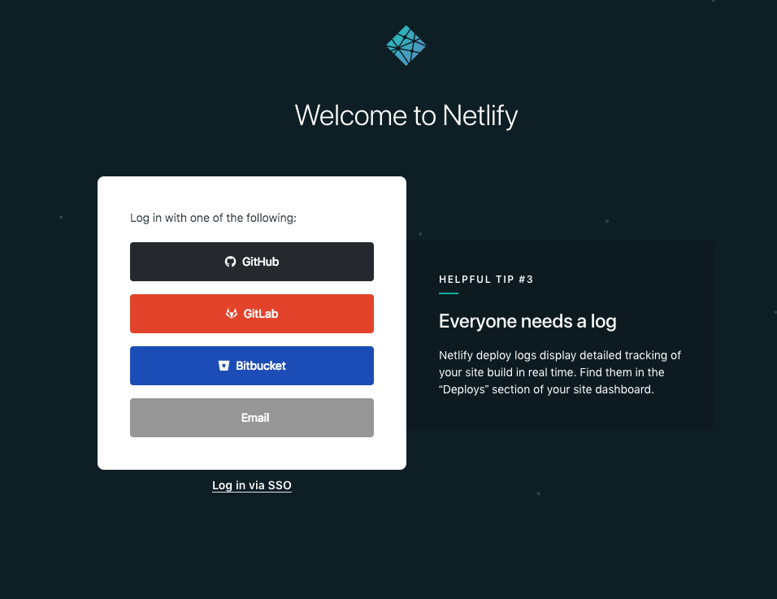

##### 新增站点

- 点击如图按钮 `New site from Git`,来新增 **站点**

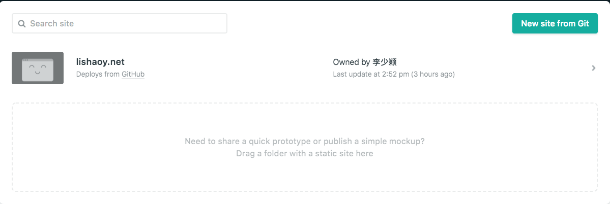

- 然后，点击如图按钮 `GitHub` 

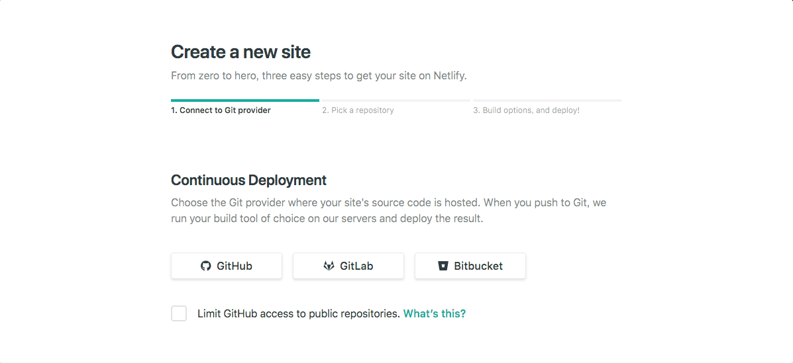

- 选择你的项目，比如我的 `MyBlog`

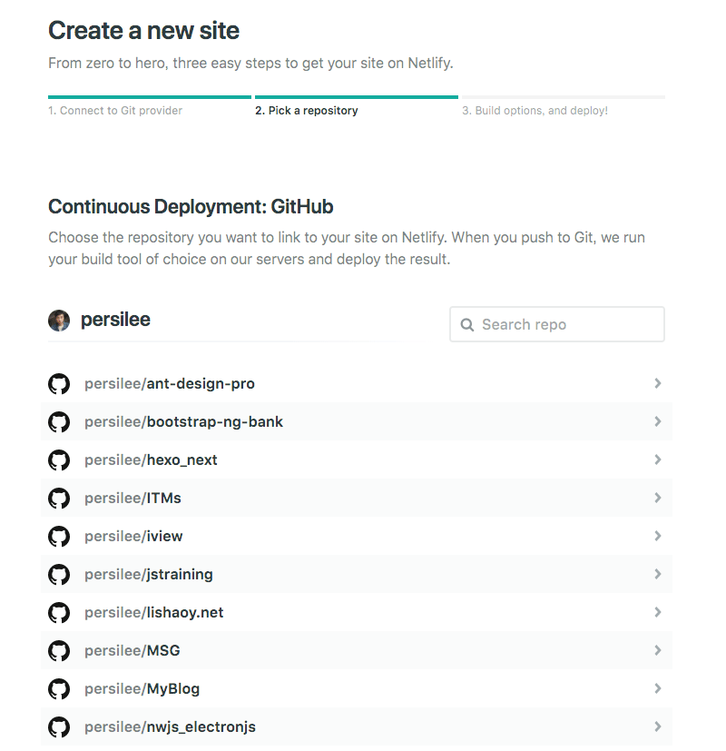

- 点击 `Deploy site`

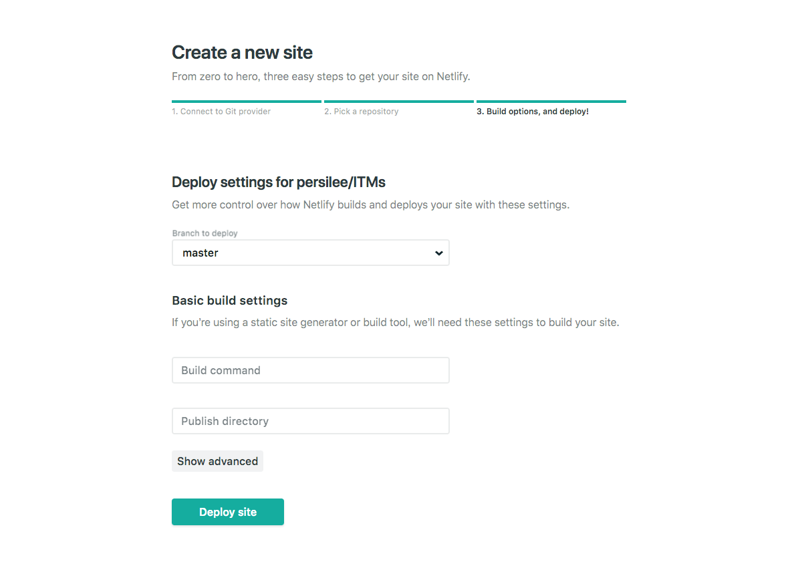

- 看到如图页面，表示成功，再点击 `Site settings` 

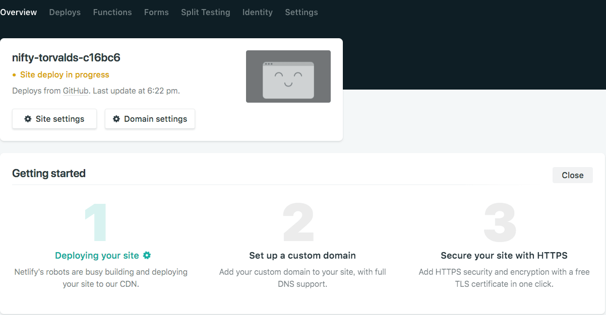

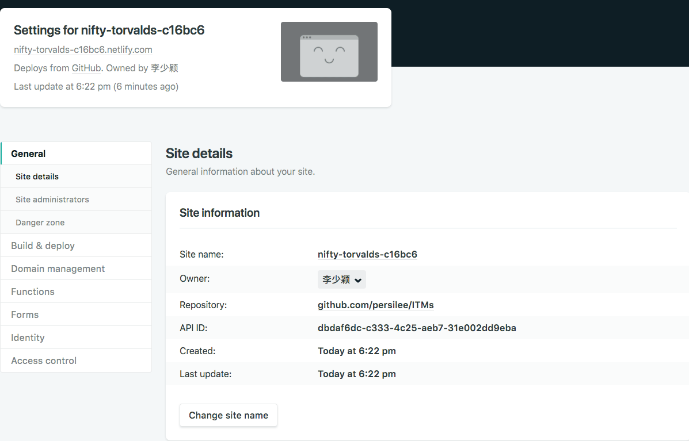

- 再点击 `Change site name` 修改短名称，方便记忆

- 在自己的域名管理中设置 **DNS** ，我使用的是 **阿里云** ，在管理界面添加如图规则

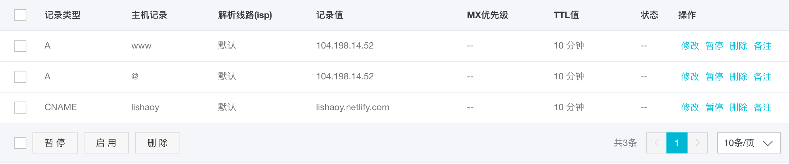

- 在点击 `Domain management` 下的 `HTTPS` ，按照步骤完成操作，稍等片刻，即可看到我们的 **域名** 已经上锁 🔐 

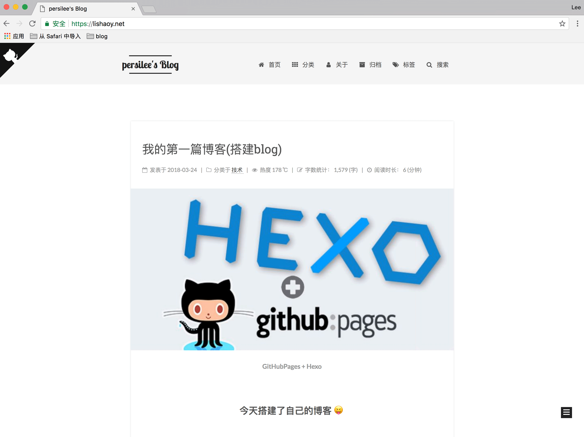

😝 😜 😄 😆 😂 🤣 ...

----
### 更换 `next` 主题

`hexo` 的主题很多，你可以选择其他喜欢 ❤️ 的主题，我使用的是 `next` 主题。

#### 安装 `next` 主题

执行以下命令，安装 `next` 主题

```vim
    git clone https://github.com/iissnan/hexo-theme-next.git themes/next
```

#### 更改配置文件

修改根目录下的 `./_config.yml` 文件，如下

```vim
# Extensions
## Plugins: https://hexo.io/plugins/
## Themes: https://hexo.io/themes/
theme: next
```

##### 重新新生成文件，推送到GitHub

重新生成文件，运行 `hexo g`

```vim
    hexo g
```
推送 **GitHub**

```vim
    hexo d
```

也可以运行以下命令，启动一个本地服务，调试确定无问题之后再 推送到 **GitHub** 

```vim
    hexo s --debug
```

本地服务启动后，可以在浏览器输入 `http://localhost:4000` 预览，如图

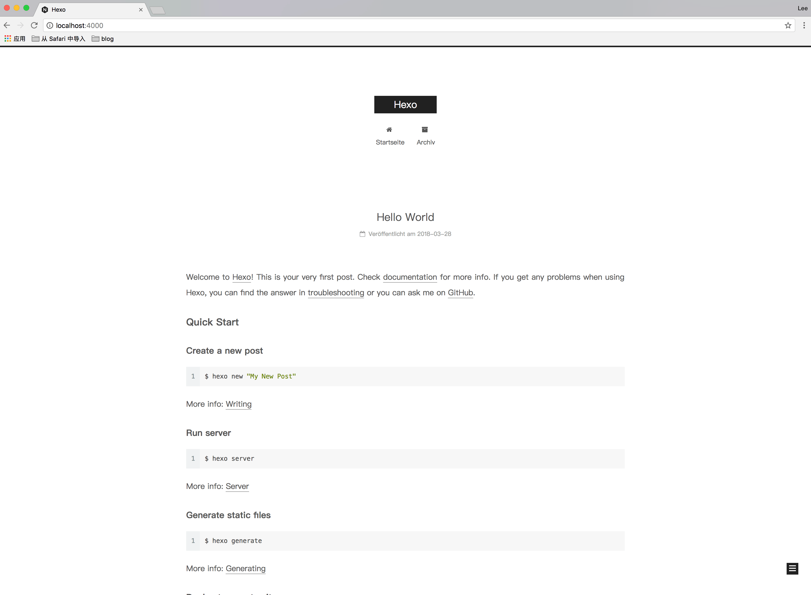

**本文到此告一段落，关于 `next` 主题美化的问题，可以参考以下链接文章 🤗**

以下是我搭建 **博客** 参考的文章链接 👇 

 

- [hexo的next主题个性化教程:打造炫酷网站](http://shenzekun.cn/hexo%E7%9A%84next%E4%B8%BB%E9%A2%98%E4%B8%AA%E6%80%A7%E5%8C%96%E9%85%8D%E7%BD%AE%E6%95%99%E7%A8%8B.html)
- [Hexo搭建博客教程](https://thief.one/2017/03/03/Hexo%E6%90%AD%E5%BB%BA%E5%8D%9A%E5%AE%A2%E6%95%99%E7%A8%8B/)
- [Hexo博客搭建全攻略(二)：NexT主题配置](https://www.jianshu.com/p/d95cff938277)

 
